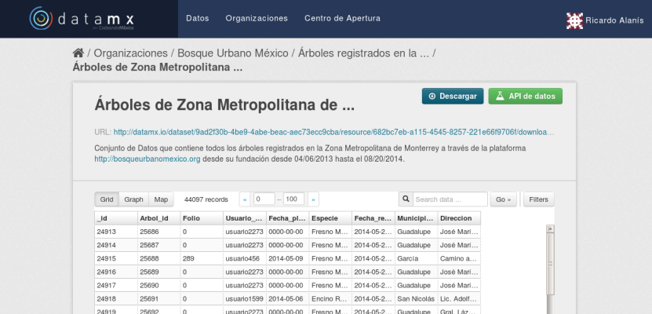

Obtención y preparación de los datos.
============

Datos con Geolocalización
------------

Click aqui para descargar los datos c/geolocalizacion los puedes encontrar aqui.

¿Qué necesito?
------------

Para este paso no necesitas descargar nada, pues el enfoque de esta hack night estará en hacer visualizaciones con los datos. Si quieres trabajar con ellos, te recomendamos descargar el software [Openrefine](http://openrefine.org/), programa que usaremos para limpiar el dataset. [Este sitio](http://openrefine.org/download.html) contiene la descarga y los pasos para correrlo en cada uno de los sistemas operativos.

Descargar la base de datos desde datamx.io
------------

La gente de BUM nos ha hecho el favor de proveernos el .csv de los árboles registrados en la zona metropolitana. Para descargalos realiza lo siguiente.

* Entra a [www.datamx.io](www.datamx.io)
* Busca árboles en la barra de búsqueda, o encuéntralo en la lista debajo.
* Da click en el título de la base de datos: Árboles registrados en la Zona Metropolitana de Monterrey
* Estarás en el listado de recursos. Da click en el recurso de nombre "Árboles de Zona Metropolitana de ..."
* Te llevará a una previsualización de los datos. Ahí, da click en el botón descargar. 

Trabajo con los datos
-----------------

Los datos que tiene BUM en línea son de bastante alta calidad, ya que no necesitan muchas transformaciones para ser útiles. Con el flow que propuse, yo encontré necesarios los siguientes pasos para sacarle más jugo:

* Convertir las columnas en fechas a formato de fecha.
* Usar el API de Bing maps para conseguir el json que contiene las coordenadas de la dirección. Google maps es más preciso, pero solo permite 5000 requests (Nuestra base de datos tiene casi 50,000). 
